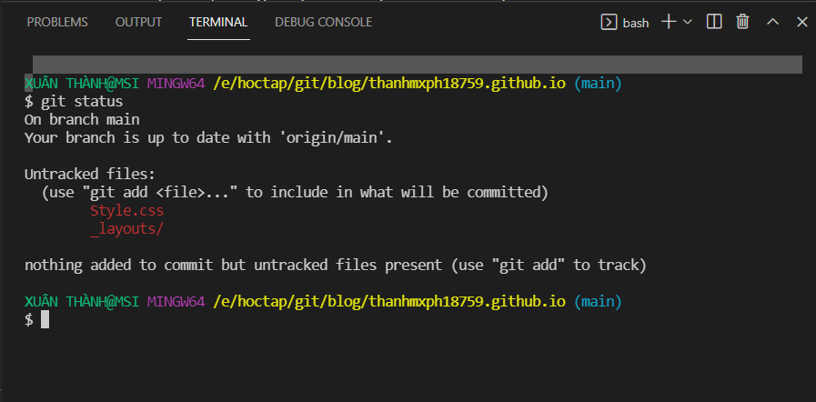
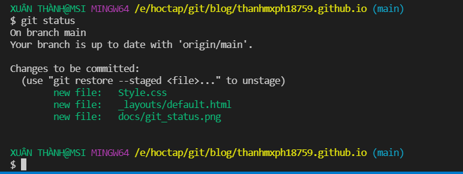
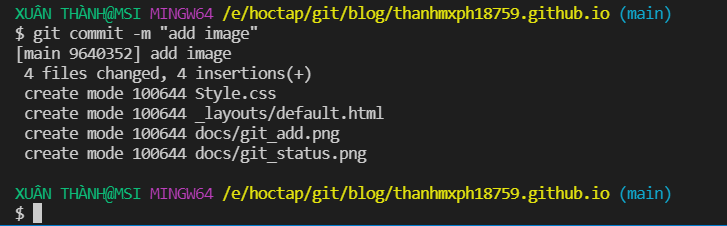
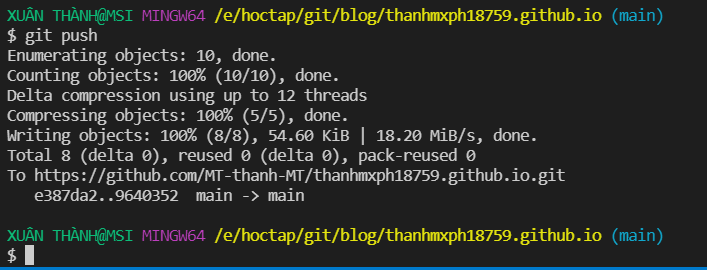

#                                  Các trạng thái của files trong git repository

-Có 2 nơi lữ trữ các file khi chúng được liên kết đến 1 remote repository trên github:
- Local Repository: Tất cả các thay đổi đã được đánh dấu (commit) sẽ được lưu ở local repo cho đến khi chúng được đẩy (push) lên remote repo. Các thay đổi này chỉ tồn tại ở trên local của người dùng ko visible với những người khác.

--

- Remote Repository: Các thay đổi đã được commit tại local repo sẽ được cập nhật lên remote repo. Lúc này những người làm việc chung cùng repo đó có thể cập nhật/kéo (pull) các thay đổi đó về máy của mình

Tất cả các file ở Local Repo đều ở một trong 2 trạng thái:

Untracked Files: Các file này dù có thay đổi / thêm / xoá thì git cũng ko quan tâm, vì nó ko nằm trong danh sách theo dõi của nó.
Khi chúng ta sử dụng lệnh “git status” thì các file này sẽ có title là “Untracked files”

Tracked Files: Những files đã được thêm vào danh sách theo dõi của git được gọi là Tracked Files, những file này khi chúng ta thay đổi / thêm / xoá thì git sẽ nhận biết được điều đó và lưu các thay đổi này lại theo yêu cầu của chúng ta.
Trong các Tracked Files được git theo dõi lại có các trạng thái sau:

Modified Files: Các file bị THAY ĐỔI
==> Các files bị thay đổi sẽ có title “Changes not staged for commit” khi chúng ta “git status”

Staged Files: Các file bị THAY ĐỔI đã được ĐÁNH DẤU để commit
==> Các files bị thay đổi sẽ có title “Changes to be committed” khi chúng ta “git status”

Unmodified Files: Khi các file đã được ĐÁNH DẤU sau khi được COMMIT sẽ lại trở về trạng thái ko thay đổi.
(Do các thay đổi này sau khi được commit sẽ được lưu vào thư mục .git, và chúng ta có thể restore về trạng thái đó bất cứ lúc nào)
==> Lúc này khi chúng ta “git status” sẽ không còn thấy các file này nữa.

nguồn : [[Git-03] Các trạng thái và câu lệnh cơ bản trong git](http://hoangvancong.com/2020/05/01/git-03-cac-trang-thai-va-cau-lenh-co-ban-trong-git/)
